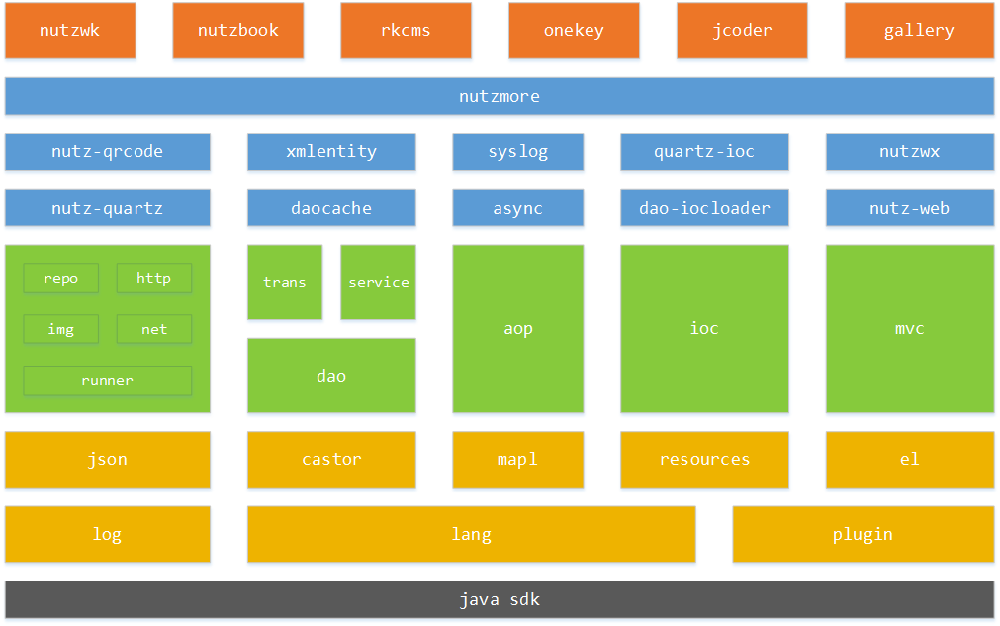

<p align="center"><a href="https://nutz.cn" target="_blank"></a></p>

[](https://travis-ci.org/nutzam/nutz)
[](https://circleci.com/gh/nutzam/nutz/tree/master)
[](https://scan.coverity.com/projects/4917/)
[](https://maven-badges.herokuapp.com/maven-central/org.nutz/nutz/)
[](http://codecov.io/github/nutzam/nutz?branch=master)
[](https://github.com/nutzam/nutz/releases)
[](https://www.apache.org/licenses/LICENSE-2.0.html)

## 项目目标

在力所能及的情况下，最大限度的提高 Java 开发人员的生产力。

*Talk is cheap. Show me the code!!*

Nutz遵循Apache协议,完全开源,文档齐全,永远免费(商用也是)

## 项目各种资源地址

*   [项目官网](https://nutzam.com)
*   [Nutz社区](https://nutz.cn/) 秒回, 就是这么爽
*   在线文档
    *   [官网](https://nutzam.com/core/nutz_preface.html) Nutz手册,涵盖方方面面
    *   [w3cschool上的文档](http://www.w3cschool.cn/nutz/) [由vincent109维护](https://github.com/vincent109)
*   [各种插件](http://github.com/nutzam/nutzmore) 您能想到的都有哦(基本上`^_^`)
*   [好玩的Nutzbook](http://nutzbook.wendal.net) 几分钟搭建一个demo有何不可? 入门从这里开始
*	[在线javadoc](https://nutzam.com/javadoc/) 注释就是这么全

## Nutz生态系统



### Maven 资源

```xml
		<dependency>
			<groupId>org.nutz</groupId>
			<artifactId>nutz</artifactId>
			<version>1.r.62</version>
		</dependency>
```


详情: https://nutzam.com/core/basic/maven.html

## Gradle 依赖

```gradle
compile(group: 'org.nutz', name: 'nutz', version:'1.r.62')
```


## Sponsorship

YourKit supports open source projects with its full-featured Java Profiler.
YourKit, LLC is the creator of [YourKit Java Profiler](http://www.yourkit.com/java/profiler/index.jsp) 
and [YourKit .NET Profiler](http://www.yourkit.com/.net/profiler/index.jsp),
innovative and intelligent tools for profiling Java and .NET applications.


JetBrains IntelliJ IDEA

http://www.jetbrains.com

## 关于我们

广州市文尔软件科技有限公司
