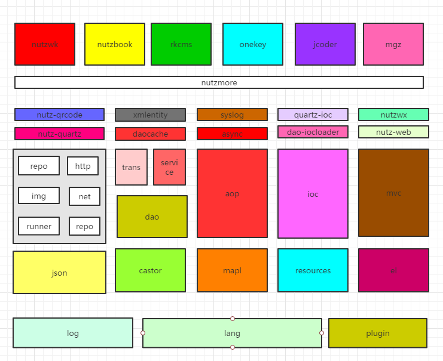

### Nutz 

<p align="center"><a href="https://nutz.cn" target="_blank"></a></p>

[](https://travis-ci.org/nutzam/nutz)
[](https://circleci.com/gh/nutzam/nutz/tree/master)
[](https://scan.coverity.com/projects/4917/)
[](https://maven-badges.herokuapp.com/maven-central/org.nutz/nutz/)
[](http://codecov.io/github/nutzam/nutz?branch=master)
[](https://github.com/nutzam/nutz/releases)
[](https://www.apache.org/licenses/LICENSE-2.0.html)


对于 Java 程序员来说，除 SSH 之外，的另一个选择

### Talk is cheap. Show me the code!!

### 项目目标

在力所能及的情况下，最大限度的提高 Web 开发人员的生产力。

### 项目各种资源地址

*   [项目官网](http://nutzam.com)
*   [Github](https://github.com/nutzam/nutz)
*   [Nutz社区](https://nutz.cn/) 有问必答,秒回复
*   在线文档
    *   [官网](http://nutzam.com/core/nutz_preface.html) 发布新版本时更新
    *   [GitHub Pages](http://nutzam.github.io/nutz/) 基本做到文档有变动就更新
*   [视频+官方发布](http://downloads.nutzam.com/)
*   [各种插件](http://github.com/nutzam/nutzmore)
*   [好玩的Nutzbook](http://nutzbook.wendal.net) 引导式nutz入门书
*	[在线javadoc](http://nutzam.com/javadoc/)
*	[案例提交](https://github.com/nutzam/nutz/issues/819) 企业项目及开源项目

现已通过 Oracle JDK 8、Oracle JDK 7、OpenJDK 7、OpenJDK 6下的 maven 测试，请查阅 [Travis CI地址](https://travis-ci.org/nutzam/nutz)、 [CircleCI地址](https://circleci.com/gh/nutzam/nutz)

### Nutz生态系统(讨论稿)



## 基于注解配置

MainModule主配置类

```java
@SetupBy(value=MainSetup.class)
@IocBy(type=ComboIocProvider.class, args={"*js", "ioc/",
										   "*anno", "net.wendal.nutzbook",
										   "*quartz",
										   "*async",
										   "*tx"
										   })
@Modules(scanPackage=true)
@ChainBy(args="mvc/nutzbook-mvc-chain.js")
@Ok("json:full")
@Fail("jsp:jsp.500")
@Localization(value="msg/", defaultLocalizationKey="zh-CN")
@Views({BeetlViewMaker.class})
@SessionBy(ShiroSessionProvider.class)
public class MainModule {
}
```

入口方法

```java
  @At
  @RequiresPermissions("user:delete")
  @Aop(TransAop.READ_COMMITTED)
  @Ok("json")
  public Object delete(@Param("id")int id) {
    int me = Toolkit.uid();
    if (me == id) {
      return new NutMap().setv("ok", false).setv("msg", "不能删除当前用户!!");
    }
    dao.delete(User.class, id); // 再严谨一些的话,需要判断是否为>0
    dao.clear(UserProfile.class, Cnd.where("userId", "=", me));
    return new NutMap().setv("ok", true);
  }
```

非MVC环境下的NutDao -- DaoUp类

```java
// 初始化DaoUp类
DaoUp.me().init(("db.properties"));

Dao dao = DaoUp.me().dao();
dao.insert("t_user", Chain.make("id", 1).add("nm", "wendal").add("age", 30));
List<Record> users = dao.query("t_user", Cnd.where("age", "<", 25).desc("nm"));

List<User> girls = dao.count(User.class, Cnd.where("age", "<", 25).and("sex", "=", "female"));

// 程序结束前销毁
DaoUp.me().close();
```

### Maven 资源

稳定发布版本

```xml
		<dependency>
			<groupId>org.nutz</groupId>
			<artifactId>nutz</artifactId>
			<version>1.r.57.r3</version>
		</dependency>
```

快照版本在每次提交后会自动deploy到sonatype快照库,享受各种bug fix和新功能

```xml
	<repositories>
		<repository>
			<id>ossrh</id>
			<url>https://oss.sonatype.org/content/repositories/snapshots</url>
			<snapshots>
				<enabled>true</enabled>
			</snapshots>
		</repository>
	</repositories>
	<dependencies>
		<dependency>
			<groupId>org.nutz</groupId>
			<artifactId>nutz</artifactId>
			<version>1.r.58-SNAPSHOT</version>
		</dependency>
		<!-- 其他依赖 -->
	</dependencies>
```

也可以将repositories配置放入$HOME/.m2/settings.xml中

或者直接去[快照库下载](https://oss.sonatype.org/content/repositories/snapshots/org/nutz/nutz/1.r.58-SNAPSHOT/)

## Android下使用nutz时的注意事项

* Dao基于JDBC API,所以无法工作
* AOP在Android的类加载机制下无法使用
* Scans及Ioc中类扫描机制,是不能工作的

### 混淆时需要加入的配置

```
### for nutz
-keepattributes Signature
-dontwarn org.nutz.**

-keep class org.nutz.castor.** { *; }
-keep interface org.nutz.castor.** { *; }

# 以下的按需选用
#-keep class org.nutz.lang.** { *; }
#-keep class org.nutz.log.** { *; }
#-keep class org.nutz.http.** { *; }
#-keep class org.nutz.json.** { *; }
#-keep class org.nutz.mapl.** { *; }
# 或直接使用全家桶
#-keep class org.nutz.** { *; }
```


## Sponsorship

YourKit supports open source projects with its full-featured Java Profiler.
YourKit, LLC is the creator of [YourKit Java Profiler](http://www.yourkit.com/java/profiler/index.jsp) 
and [YourKit .NET Profiler](http://www.yourkit.com/.net/profiler/index.jsp),
innovative and intelligent tools for profiling Java and .NET applications.


JetBrains IntelliJ IDEA

http://www.jetbrains.com

